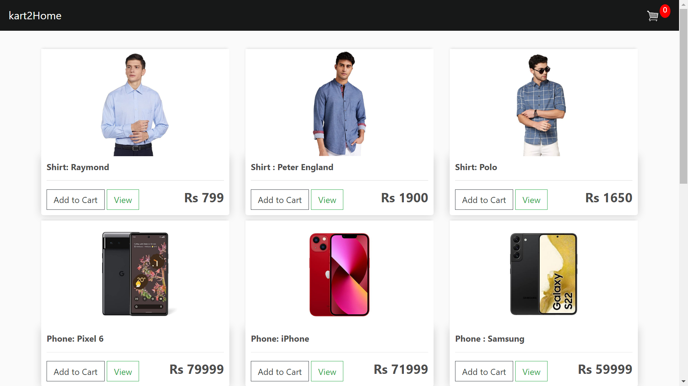
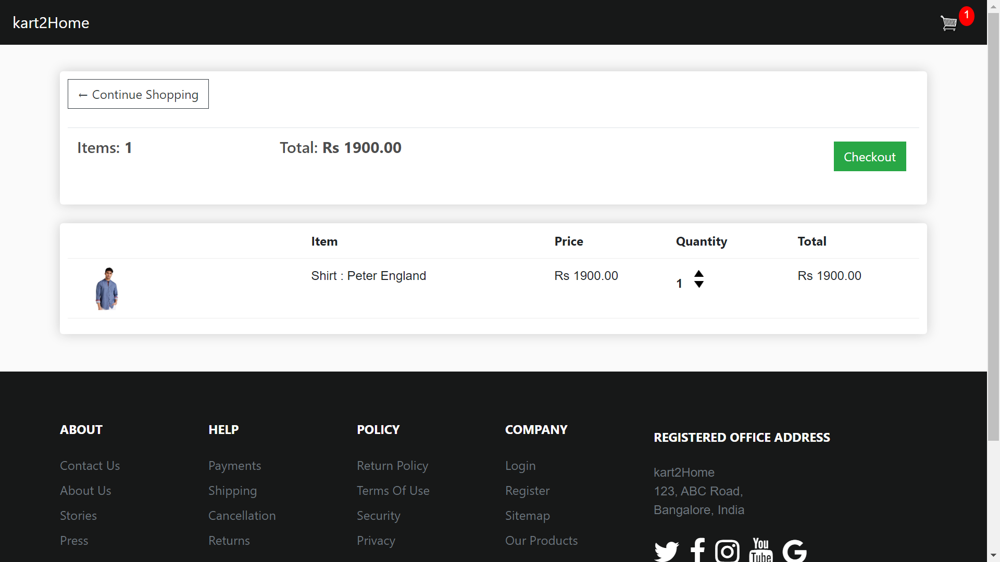
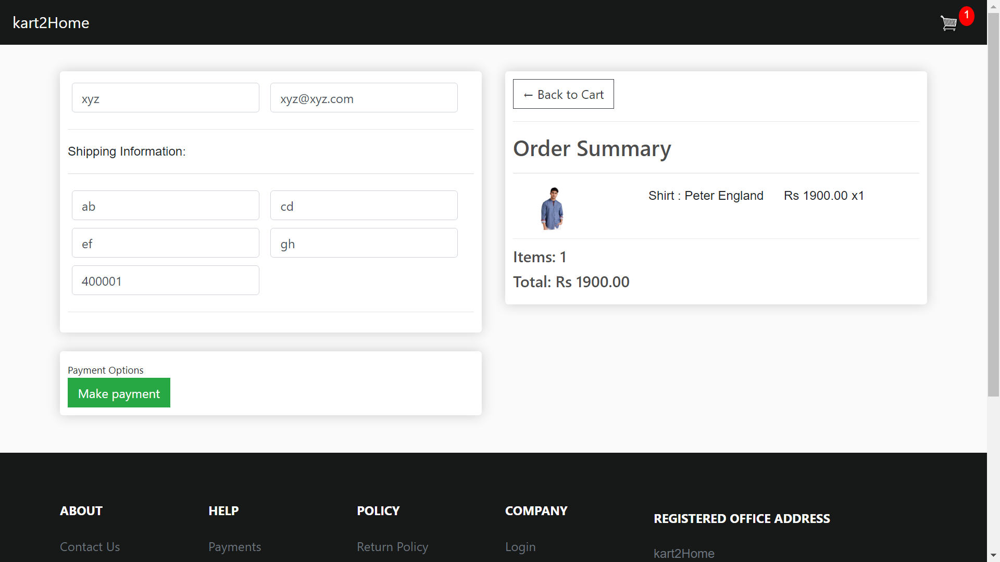

     
  <a target="blank" href="https://kart2home.herokuapp.com/"><strong>Explore the app here »</strong></a>

# kart2Home
End to end ecommerce website built from scratch where users can add items to the cart, delete items and update the quantity of item.

# Built With
* Frontend - HTML, CSS
* Backend - JavaScript, Python Django
* Deployment Platform - Heroku
 
# Database UML

# Screenshots
Main Page

Cart Page

Checkout Page

# Future Goals
* To integrate the payment gateway like razorpay
* To display and track the order details 
* To improve the UI/UX of the website

# License

The project is acquired under the [MIT License](https://docs.github.com/en/repositories/managing-your-repositorys-settings-and-features/customizing-your-repository/licensing-a-repository#disclaimer).
