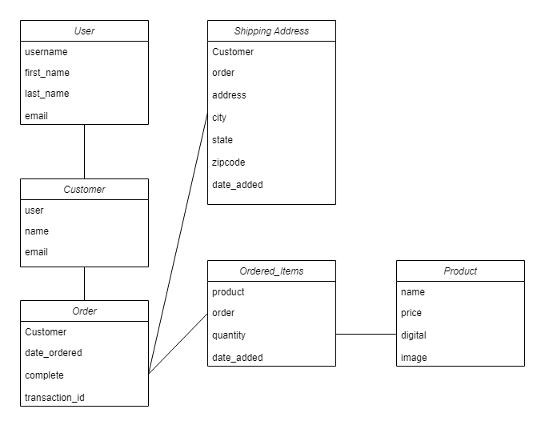

# kart2Home
 An ecommerce website made with HTML, CSS, JavaScript, Python, Django. End to end ecommerce website built from scratch where users can add items to the cart, delete items and update the quantity of item
 
# Database UML

# Screenshots
Main Page

Cart Page

Checkout Page

